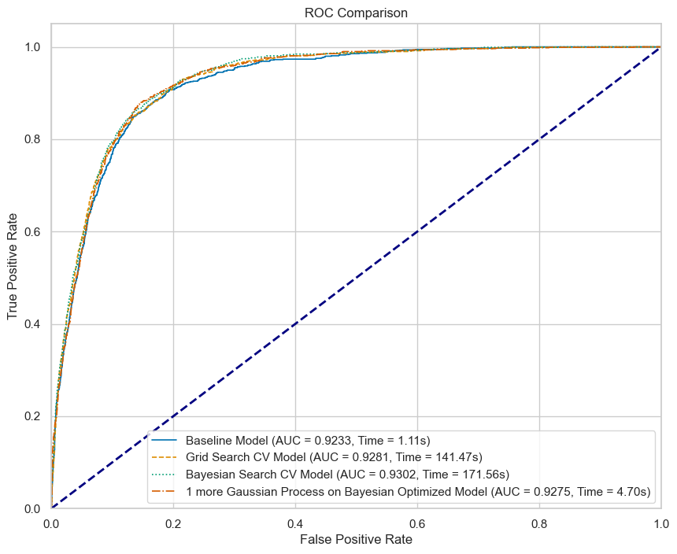
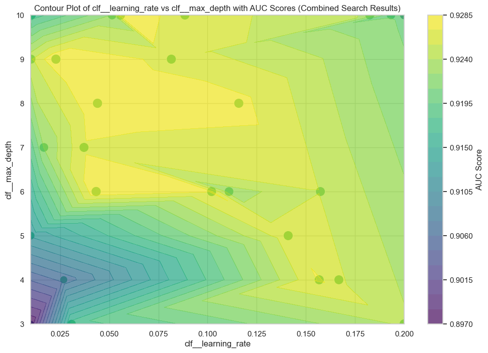

# Educated Hyperparameter Optimization

This project demonstrates the use of different hyperparameter optimization techniques to improve the performance of machine learning models. Specifically, it focuses on Bayesian Search Optimization (BSO), Grid Search Optimization, and Random Search Optimization. The primary model used in this example is an XGBoost classifier.

## Table of Contents

- [Introduction](#introduction)
- [Installation](#installation)
- [Usage](#usage)
- [Results](#results)
- [Contributing](#contributing)
- [License](#license)

## Introduction

Hyperparameter optimization is a crucial step in machine learning model development. It involves selecting the best set of hyperparameters to maximize the model's performance. Traditional methods like Grid Search and Random Search can be time-consuming and computationally expensive. Bayesian Search Optimization (BSO) offers a more efficient approach by leveraging probabilistic models.

### Why Bayesian Search Optimization (BSO)?

- **Efficiency**: BSO can find optimal hyperparameters with fewer iterations compared to Grid Search and Random Search.
- **Gaussian Process (GP)**: BSO uses the Gaussian Process to model the objective function and predict the performance of different hyperparameter sets. The GP helps determine the parameters that are most likely to improve the model's score in subsequent iterations.
- **Probability of Improvement**: BSO calculates the probability of improving the score, allowing for more informed decisions during the optimization process.

## Installation

Clone the repository and install the required dependencies:

```bash
git clone https://github.com/carlosk91/educated-hyperparameter-optimization.git
cd educated-hyperparameter-optimization
pip install -r requirements.txt
```

## Usage

To run the hyperparameter optimization and evaluate the models, execute the following script:

```bash
python src/educated-hyperparameter-optimization.py
```

The script will perform the following steps:

1. Fetch and prepare the dataset.
2. Split the data into training and testing sets.
3. Create a preprocessing pipeline.
4. Train models using Baseline, Grid Search, and Bayesian Search methods.
5. Fit a Gaussian Process model on the Bayesian Search results to predict optimal hyperparameters.
6. Calculate the probability of improving the model's performance in the next iteration.
7. Plot and save ROC curves for model comparison.

### Key Functions

- fit_hyperparameters_model(search_results): Fits a Gaussian Process model on the Bayesian Search results.
- predict_optimal_hyperparameters(gp_model, param_space): Predicts optimal hyperparameters using the Gaussian Process model.
- calculate_probability_of_improvement(bayes_result, predicted_auc, predicted_std_dev): Calculates the probability of finding a better model than the current best.

## Results

The results of the hyperparameter optimization are as follows:

- **Baseline Model**: AUC = 0.9233, Training time = 1.11s
- **Grid Search CV Model**: AUC = 0.9267, Training time = 141.47s
- **Bayesian Search CV Model**: AUC = 0.9302, Training time = 171.56s
- **Gaussian Process on Bayesian Optimized Model**: AUC = 0.9275, Training time = 4.70s

The optimal predicted ROC AUC after the next iteration on the Gaussian Process is 0.9237 ± 0.0107. The probability of finding a better model than the current best on the next iteration is 19.12%.

### ROC Curve Comparison


This shows that if there's an urgent need to deploy a model, a baseline, well-built model will fulfill the requirements.

### Contour plot of Learning Rate vs Max Depth with AUC Scores (

.png)

Plot to show the AUC space according to the two most correlated hyperparameters with itself.

## Contributing

Contributions are welcome! Please feel free to submit a Pull Request.

## License

This project is licensed under the MIT License.
